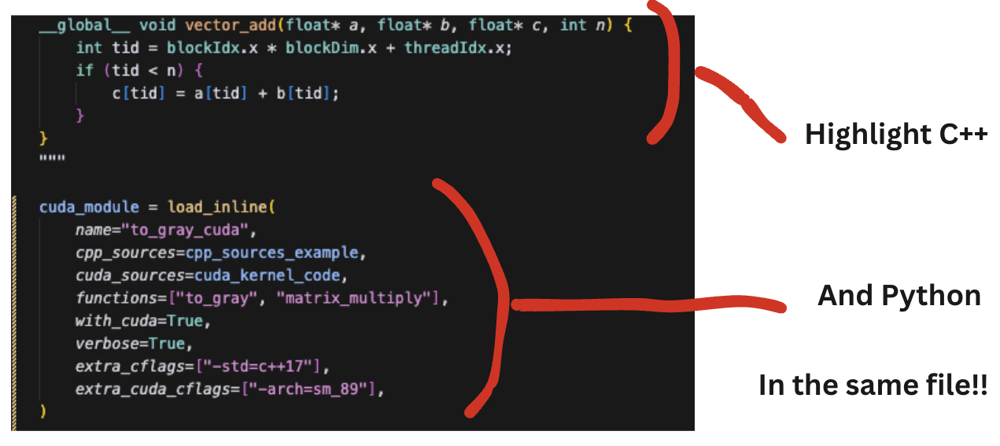

# PyTorch load_inline() Syntax Highlighter

A Visual Studio Code extension that provides syntax highlighting for C++, CUDA, and HIP/ROCm code within Python string literals used with PyTorch's `load_inline()` function.



## Features

- **Automatic Detection**: Recognizes C++/CUDA/HIP/ROCm code in various contexts:
  - `cpp_sources="..."`, `cuda_sources="..."`, and `hip_sources="..."` parameters
  - Variables ending with `_cpp`, `_cuda`, `_hip`, `_kernel`
  - Variables starting with `cpp_`, `cuda_`, or `hip_`
  - Content-based detection (e.g., `torch::Tensor`, `__global__`, `blockIdx`, `hipBlockIdx_x`)

- **Multi-String Support**: Works with single quotes, double quotes, and triple quotes
- **Context-Aware**: Only activates within Python files
- **Lightweight**: Uses TextMate grammar injection for optimal performance

## Installation

### From Source

1. Clone this repository
2. Install dependencies: `npm install`
3. Compile: `npm run compile`
4. Install the extension in VS Code:
   - Open VS Code
   - Go to Extensions (Ctrl+Shift+X)
   - Click "..." → "Install from VSIX..."
   - Select the generated `.vsix` file

### Development

1. Open this project in VS Code
2. Press F5 to launch Extension Development Host
3. Open a Python file with `load_inline()` code
4. Verify syntax highlighting works

## Usage Examples

The extension automatically highlights C++/CUDA/HIP/ROCm code in these patterns:

```python
# Variable name patterns
cpp_code = """
torch::Tensor my_function(torch::Tensor input) {
    return input * 2.0;
}
"""

cuda_kernel_code = """
__global__ void my_kernel(float* data, int size) {
    int idx = blockIdx.x * blockDim.x + threadIdx.x;
    if (idx < size) {
        data[idx] *= 2.0f;
    }
}
"""

hip_kernel_code = """
__global__ void hip_kernel(float* data, int size) {
    int idx = hipBlockIdx_x * hipBlockDim_x + hipThreadIdx_x;
    if (idx < size) {
        data[idx] *= 2.0f;
    }
}
"""

# Function parameters
load_inline(
    name="my_module",
    cpp_sources="""
    #include <torch/extension.h>
    torch::Tensor process(torch::Tensor x) { return x; }
    """,
    cuda_sources="""
    __global__ void kernel(float* x, int n) {
        int i = blockIdx.x * blockDim.x + threadIdx.x;
        if (i < n) x[i] *= 2.0f;
    }
    """,
    hip_sources="""
    __global__ void hip_kernel(float* data, int size) {
        int idx = hipBlockIdx_x * hipBlockDim_x + hipThreadIdx_x;
        if (idx < size) data[idx] *= 2.0f;
    }
    """,
    with_rocm=True
)
```

## Supported Patterns

### Variable Names
- `*_cpp`, `*_cuda`, `*_hip`, `*_kernel`
- `cpp_*`, `cuda_*`, `hip_*` 
- `cpp_code`, `cuda_kernel_code`, `hip_kernel_code`, `kernel_code`

### Function Parameters
- `cpp_sources=`
- `cuda_sources=`
- `hip_sources=`

### Content Detection
- C++: `torch::Tensor` declarations
- CUDA: `__global__`, `__device__`, `__host__`, `blockIdx`, `threadIdx`
- HIP: `hipBlockIdx_x`, `hipThreadIdx_x`, `hipLaunchKernelGGL`, `hipDeviceSynchronize`

## Requirements

- Visual Studio Code 1.74.0 or higher
- Existing C++ extension (built-in with VS Code)
- Optional: CUDA or HIP/ROCm extensions for enhanced GPU code features

## Publishing to VS Code Marketplace

### Method 1: Web Upload (Recommended)

1. **Create Publisher Account**:
   - Go to https://marketplace.visualstudio.com/manage
   - Sign in with your Microsoft account
   - Create a new publisher with ID `msaroufim`

2. **Upload Extension**:
   - Click "New Extension" → "Visual Studio Code"
   - Upload the `pytorch-load-inline-highlighter-1.0.0.vsix` file
   - The marketplace will automatically read metadata from the package
   - Review the details and click "Upload"

3. **Verify Information**:
   - **Display Name**: PyTorch load_inline() Syntax Highlighter
   - **Publisher**: msaroufim
   - **Version**: 1.0.0
   - **Repository**: https://github.com/msaroufim/pytorch-load-inline-highlighter

### Method 2: Command Line (Alternative)

1. **Generate Personal Access Token**:
   - Visit https://dev.azure.com (create account if needed)
   - Go to User Settings → Personal Access Tokens
   - Create token with "Marketplace (Manage)" scope

2. **Publish via CLI**:
   ```bash
   cd pytorch-load-inline-highlighter
   npx vsce login msaroufim
   # Enter your Personal Access Token when prompted
   npx vsce publish
   ```

### Updating the Extension

For future updates:
- Increment version in `package.json`
- Run `npx vsce package` to create new `.vsix` file
- Upload new version via web interface or CLI

## Acknowledgements

Thank you to Steven Arellano for giving me the idea to just go ahead and do this and thank you Claude for doing it.

## License

MIT